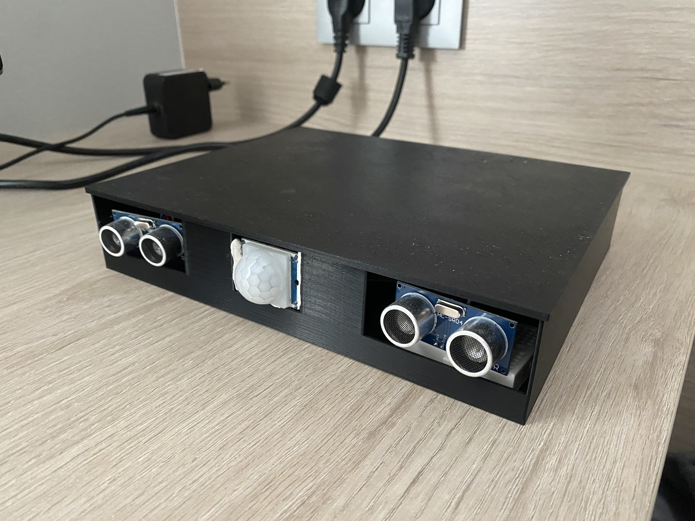
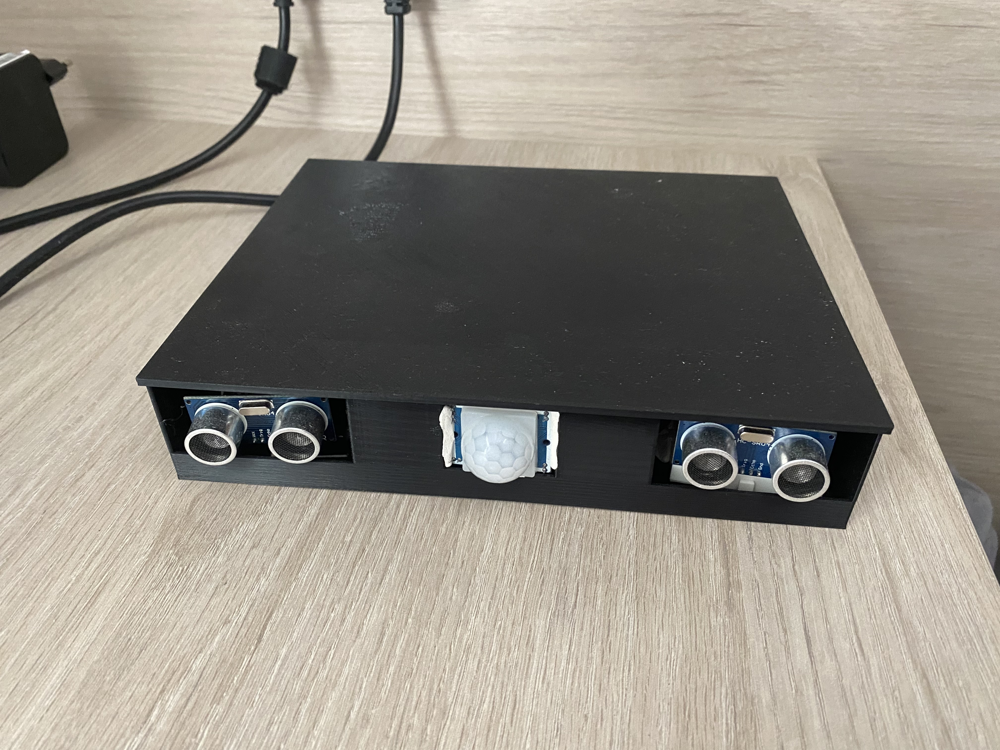
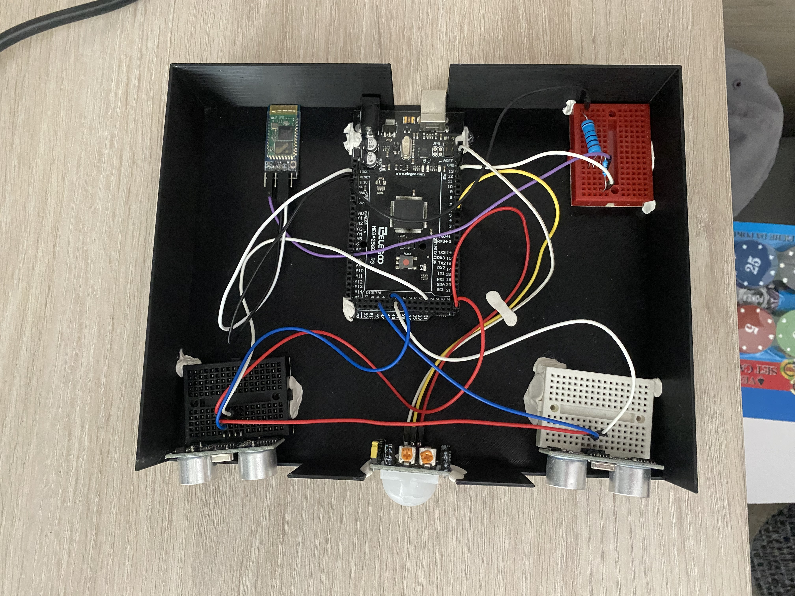
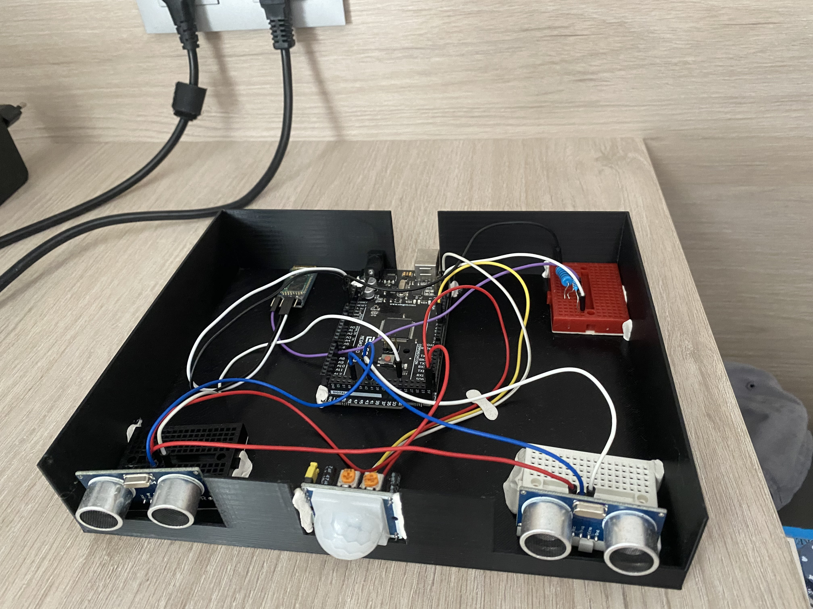

# Movement detection system

The goal of this project is to use an Arduino as an emitting device of three movement signals in order to analyse them and study the feasibility of distinguish different types of movement with such an cheap device. 

# Equipment
Board: ELEGOO Mega de 2560 R3
Modules: MicroSD Board reader, Bluetooth Module Board
Sensors: PIR(1), Ultrasonic(2)

# System images:

